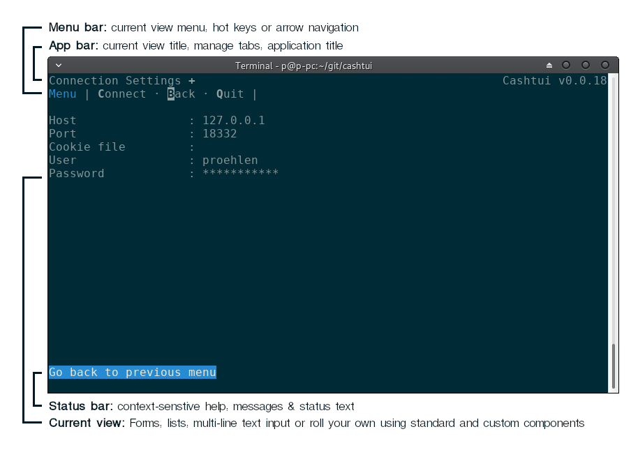

# Tooey - Build rich Text UIs with Node.js

Tooey (pronounced "too-ee") is a library and framework for creating rich [text-based user interfaces](https://en.wikipedia.org/wiki/Text-based_user_interface) in Node.js.

**This software under construction and in a pre-Alpha state.**

## Features

## API

Api docs can be found [here](https://proehlen.github.io/tooey/#/api).